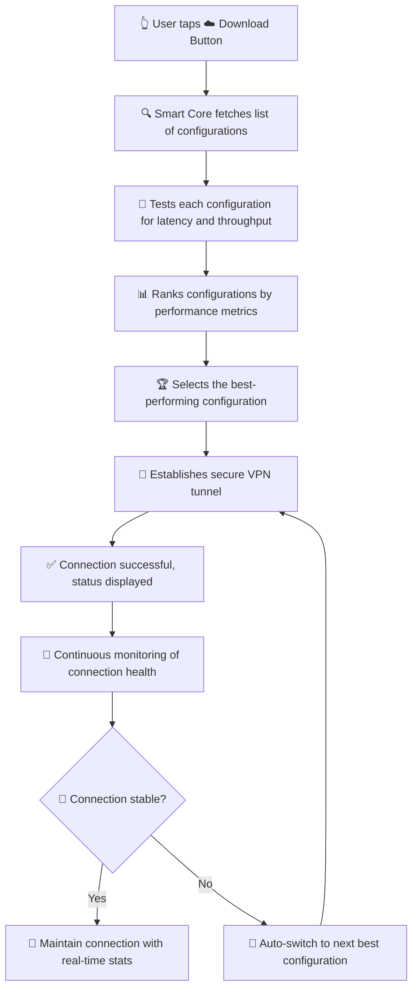
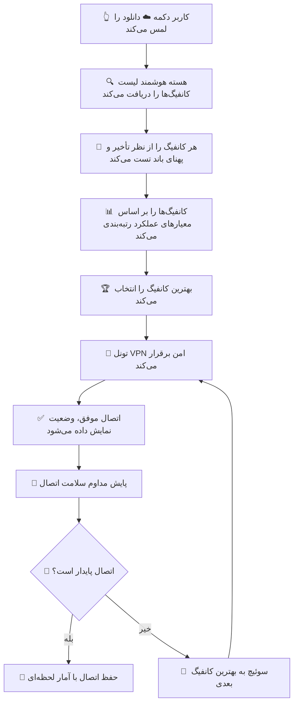

🌟 Hamed VPN | VPN حـــامد

<p align="center">
  
  
  
  
  
  
  
  
  
  
  
</p>

---

🌐 Language Selection | انتخاب زبان

Click a button below to jump to your preferred language
برای رفتن به زبان مورد نظر، روی دکمه زیر کلیک کنید

<p align="center">
  <a href="#-english-version"></a>
  &nbsp;&nbsp;&nbsp;
  <a href="#-فارسی"></a>
</p>

---

<br>

🇬🇧 English Version

<p align="center">
  
</p>

---

📖 Table of Contents

1. 🚀 Introduction
2. ✨ Key Features
3. 🧠 Smart Auto-Connect Technology
4. 📥 Download & Installation
5. 🎯 How to Use Hamed VPN
6. 🌍 Geoip & Geosite Configuration
7. 🛡️ Security & Privacy
8. 🔧 Advanced Configuration
9. 🛠️ Development Guide
10. 🔐 GPG Verification
11. 💬 Community & Support
12. 🤝 Contributing
13. ❓ FAQ (Frequently Asked Questions)
14. 🔍 Troubleshooting
15. 📜 Changelog
16. 📄 License
17. 🙏 Acknowledgments

---

🚀 Introduction

Hamed VPN is an intelligent, powerful, and user-friendly Android VPN client, specially enhanced to bypass internet restrictions in countries like Iran. It leverages the latest V2Ray and Xray cores to provide a secure, fast, and reliable internet experience, completely free and open-source.

🌟 What Makes Hamed VPN Special?

Unlike traditional VPNs that require manual configuration, Hamed VPN features a revolutionary smart auto-connect engine that automatically fetches, tests, and connects to the best-performing configuration with a single tap. No more struggling with server addresses, ports, or UUIDs — the intelligent core does all the heavy lifting for you.

· 🎯 One-Tap Freedom: Just tap the ☁️ cloud-shaped download button on the main screen, and let the smart core do its magic.
· 🧠 Self-Healing Network: If your connection drops, the core instantly switches to a backup configuration without interrupting your browsing.
· 🇮🇷 Iran-Optimized: The configurations are meticulously curated and tested to bypass deep packet inspection (DPI) and other restrictions specific to Iran's internet landscape.
· ⚡ Blazing-Fast Performance: The core selects the configuration with the lowest latency and highest bandwidth, ensuring a smooth streaming and browsing experience.
· 🔒 Enterprise-Grade Security: All traffic is encrypted using modern cryptographic protocols, protecting your privacy from surveillance and data theft.

---

✨ Key Features

Here's a comprehensive list of features that make Hamed VPN the ultimate choice for unrestricted internet access:

Feature Description
🤖 Smart Auto-Connect The intelligent core automatically extracts, tests, and connects to the best available configuration with zero manual input.
☁️ One-Tap Operation Simply tap the cloud-shaped download button on the main screen to start the entire process.
🔄 Automatic Failover If the current connection becomes unstable or drops, the core seamlessly switches to another configuration without user intervention.
🌐 Multi-Protocol Support Supports VMess, VLESS, Trojan, Shadowsocks, and Socks protocols, ensuring compatibility with a wide range of servers.
🚀 High-Speed Tunneling Optimized for speed and low latency, perfect for HD streaming, gaming, and large file downloads.
🛡️ Full Encryption All data is encrypted using strong ciphers (e.g., AES-256-GCM, ChaCha20-Poly1305) to prevent eavesdropping and man-in-the-middle attacks.
📍 Smart Routing Uses updated geoip.dat and geosite.dat files to intelligently route traffic, bypassing censorship and optimizing performance.
🔄 Auto-Update Datasets Built-in updater fetches the latest routing rules from trusted repositories (e.g., Loyalsoldier) to keep your configurations current.
📱 Intuitive UI Clean, modern, and material-design interface that is easy to navigate for both beginners and advanced users.
🌙 Dark Mode Support Automatically adapts to your system theme for a comfortable viewing experience at night.
📶 Real-Time Status Displays connection speed, latency, data usage, and server location in real-time.
🛑 Kill Switch Automatically blocks all internet traffic if the VPN disconnects, preventing data leaks.
🔋 Battery Optimized Efficiently manages resources to minimize battery drain while maintaining a stable connection.
🧩 Custom Rules Advanced users can define custom routing rules, proxy settings, and DNS configurations.
📊 Traffic Statistics Tracks total data usage and provides detailed logs for troubleshooting.
🔐 No Logs Policy We do not collect, store, or share any user data. Your privacy is paramount.
🌍 Global Server Network Access to a wide range of servers across the globe, optimized for speed and reliability.
🧪 Beta Features Early access to experimental features for those who want to test cutting-edge technologies.

---

🧠 Smart Auto-Connect Technology

The Smart Auto-Connect Engine is the heart of Hamed VPN. It revolutionizes the way you connect to the internet by automating the entire process of finding and using the best configuration.

🔄 How It Works (Step-by-Step)



🧠 Why It's a Game-Changer

· 📈 Intelligent Testing: The core performs multiple tests (ping, download speed, upload speed) to evaluate each configuration's performance in real-world conditions.
· 📊 Data-Driven Selection: It uses a weighted scoring algorithm that considers latency, packet loss, bandwidth, and server load to pick the optimal configuration.
· 🔄 Self-Learning: Over time, the core learns which configurations perform best for your network and prioritizes them, reducing test time.
· 🌐 Dynamic Adaptation: The core can adapt to changing network conditions (e.g., during peak hours) by re-testing and switching to a better configuration if needed.
· ⚡ Zero Downtime: The failover mechanism ensures you never experience extended interruptions; switching happens in milliseconds.

🎯 Why It's Essential for Iran

· 🛡️ Bypassing DPI: The configurations are specially designed to evade deep packet inspection by mimicking regular HTTPS traffic or using obfuscation techniques.
· 🔀 Rotating IPs: The core can rotate through multiple IPs to avoid detection and blocking by ISPs.
· 🧩 Fragmented Networks: Iran's internet is heavily fragmented, but Hamed VPN's smart core can find a working path even when several servers are blocked.

---

📥 Download & Installation

🔽 Get the Latest Stable Release

Hamed VPN v1.0.0 (Stable) is now available for download. This release has been thoroughly tested and is recommended for all users.

<p align="center">
  <a href="https://github.com/hamedp-71/HamedVPN/releases/tag/v1.0.0">
    
  </a>
</p>

📱 Installation Steps

Follow these simple steps to get started:

1. Download the APK from the link above.
2. Enable "Unknown Sources" in your Android settings:
   · Go to Settings → Security → Install unknown apps → select your file manager and enable "Allow from this source".
3. Locate and open the APK file using your file manager.
4. Tap "Install" and wait for the installation to complete.
5. Open the app from your app drawer or home screen.
6. Grant necessary permissions when prompted:
   · ✅ VPN permission (required for tunneling)
   · ✅ Notification permission (for connection status alerts)
   · ✅ Storage permission (optional, for importing custom configs)
7. Tap the ☁️ cloud-shaped download button on the main screen to start the smart auto-connect process.
8. Wait for the core to fetch, test, and connect (usually takes 10-20 seconds).
9. Enjoy unrestricted, fast, and secure internet!

[!NOTE]
The app supports Android API 24 (Android 7.0) and above. For older devices, consider using a lightweight alternative.

---

🎯 How to Use Hamed VPN

🧭 User Interface Overview

Component Function
☁️ Download Button Initiates the smart auto-connect process. Tap it to start connecting.
📊 Status Bar Shows current connection status (Connecting, Connected, Disconnected) and server info.
📶 Speed Indicator Displays real-time download/upload speeds and latency (ping).
📈 Traffic Stats Shows total data usage for the current session and overall.
⚙️ Settings Menu Access advanced settings, proxy rules, DNS, and core selection.
🗺️ Server List (Optional) Manually select a server from the list if auto-connect is disabled.
🌙 Theme Toggle Switch between Light and Dark modes.
📋 Log Viewer View detailed logs for troubleshooting.

🚀 Quick Start Guide

1. First-time users should tap the ☁️ download button to let the core fetch configurations.
2. Once connected, you'll see a key icon in the status bar indicating VPN is active.
3. To disconnect, tap the ☁️ button again or use the disconnect option in the notification.
4. Automatically reconnect by simply tapping the button again; the core will remember your previous settings.
5. Customize your experience via the settings menu (e.g., change DNS, toggle kill switch, set auto-start).

---

🌍 Geoip & Geosite Configuration

📍 File Locations

The routing rule files are stored in the following directory on your device:

```
Android/data/com.v2ray.ang/files/assets/
```

· geoip.dat – Contains IP address ranges for geolocation-based routing.
· geosite.dat – Contains domain lists for website-based routing.

⚡ Auto-Update Feature

The app includes a built-in downloader that fetches the latest versions of these files from the Loyalsoldier repository:

· Loyalsoldier/v2ray-rules-dat

[!CAUTION]
The auto-update feature requires an active proxy connection (i.e., you must be connected to the internet via VPN) to work, as the repository may be blocked in certain regions.

📂 Manual Import

If you prefer to manage the files manually, you can download the latest versions from:

· Geosite (Domain List)
· Geoip (IP List)

Place the downloaded .dat files in the above directory, overwriting the existing ones.

🔧 Using Custom .dat Files

You can use third-party rule sets (e.g., from h2y, v2fly, or custom builds) by simply copying them into the same directory. The app will automatically detect and use them.

📖 For advanced routing rules, refer to the Official V2Ray Routing Guide.

---

🛡️ Security & Privacy

Hamed VPN is built with security and privacy as its top priorities. Here's how we protect you:

Aspect Implementation
🔐 Encryption All traffic is encrypted using AES-256-GCM or ChaCha20-Poly1305 ciphers, depending on the protocol.
🛑 Kill Switch If the VPN disconnects unexpectedly, the kill switch immediately blocks all internet traffic to prevent data leaks.
🌐 DNS Leak Protection DNS queries are routed through the VPN tunnel, preventing DNS leaks that could reveal your browsing activity.
🚫 No Logging We do not collect, store, or share any user data, including browsing history, IP addresses, or connection timestamps.
🔑 Perfect Forward Secrecy Each session uses unique ephemeral keys, ensuring that even if a key is compromised, past sessions remain secure.
🧪 Open-Source Code The entire codebase is open-source, allowing independent security audits and transparency.
📡 Split Tunneling (Optional) Route only specified apps through the VPN, while others use the direct connection.

---

🔧 Advanced Configuration

🧩 Custom Proxy Settings

Advanced users can fine-tune the proxy configuration via the settings menu:

· Protocol Selection: Choose between VMess, VLESS, Trojan, Shadowsocks, and Socks.
· Custom Headers: Add custom HTTP headers to obfuscate traffic further.
· Multiplexing: Enable to reduce latency by multiplexing multiple requests over a single connection.
· Mux Settings: Configure concurrency and other parameters.

🌐 DNS Configuration

You can specify custom DNS servers (e.g., 1.1.1.1, 8.8.8.8) to bypass DNS-based censorship. The app supports both DoH (DNS over HTTPS) and DoT (DNS over TLS) for enhanced privacy.

📊 Routing Rules

Define custom routing rules using geosite and geoip tags:

· Direct: Bypass the proxy for specified domains/IPs.
· Proxy: Route through the VPN tunnel.
· Block: Deny access entirely.

Example routing rule (in JSON):

```json
{
  "rules": [
    {
      "domain": ["geosite:cn"],
      "outboundTag": "direct"
    },
    {
      "ip": ["geoip:private"],
      "outboundTag": "block"
    }
  ]
}
```

---

🛠️ Development Guide

📱 Building the Android App

The Android project is located in the V2rayNG folder. You can build it using:

· Android Studio (recommended for GUI development)
· Gradle Wrapper (for command-line builds)

```bash
# Clone the repository
git clone https://github.com/2dust/v2rayNG.git
cd v2rayNG/V2rayNG

# Build debug APK
./gradlew assembleDebug

# Build release APK (requires signing keys)
./gradlew assembleRelease
```

[!WARNING]
The bundled v2ray core inside the AAR file may be outdated. It is highly recommended to compile a fresh core from the source to ensure the latest security patches and features.

⚙️ Compiling the Core (AAR)

To generate an updated .aar file, you must compile the GoLang projects:

· AndroidLibV2rayLite – for V2Ray core
· AndroidLibXrayLite – for Xray core

Prerequisites:

· Go 1.19+
· Android NDK r23+
· Gomobile installed

Quick Build Steps:

```bash
# Install gomobile
go get -u golang.org/x/mobile/cmd/gomobile
gomobile init

# Clone the core repository
git clone https://github.com/2dust/AndroidLibXrayLite.git
cd AndroidLibXrayLite

# Build the AAR (adjust path for your environment)
gomobile bind -target=android -o libxray.aar .
```

📖 For more details, see the Go Mobile Guide and Makefiles for Go Developers.

🖥️ Running on Emulators & WSA

· Android Emulators: Hamed VPN works seamlessly on all standard Android emulators (e.g., AVD, Genymotion).
· Windows Subsystem for Android (WSA):
  You need to manually grant VPN permissions via ADB:
  ```bash
  adb shell appops set com.v2ray.ang ACTIVATE_VPN allow
  ```

---

🔐 GPG Verification

All release files (APKs, AARs, and source tarballs) are cryptographically signed with GPG to ensure authenticity and integrity. This protects you from tampering by malicious mirrors, ISPs, or CDN providers.

📋 Public Key Fingerprint

```
7694 5E9F 3E9A 168F 8070 F195 805D 661C
134D FAF6 8903 C199 463C 31E5 AE90 3AE0
```

🔍 How to Verify

1. Import the public key:
   ```bash
   gpg --recv-keys 76945E9F3E9A168F8070F195805D661C134DFAF68903C199463C31E5AE903AE0
   ```
2. Download the .asc signature file for the APK.
3. Verify the signature:
   ```bash
   gpg --verify v2rayNG-v1.0.0.apk.asc v2rayNG-v1.0.0.apk
   ```

If the output shows Good signature, the file is authentic.

---

💬 Community & Support

Stay connected with the Hamed VPN community:

Platform Purpose Link
📱 Telegram Support Group Discussion, help, and community support t.me/hamedgrp
📢 Telegram Channel Official announcements and update alerts t.me/hamedvpns
🐛 GitHub Issues Bug reports and feature requests Issues Page
📖 Official Wiki Comprehensive documentation and guides Wiki

[!IMPORTANT]
For urgent support, please use the Telegram group for faster responses. Do not spam the issue tracker with support questions.

---

🤝 Contributing

We warmly welcome contributions from the community! Whether you're a developer, designer, or just a passionate user, there are many ways to help:

🧑‍💻 Code Contributions

1. 🍴 Fork the repository on GitHub.
2. 🌿 Create a new branch for your feature or fix:
   ```bash
   git checkout -b feature/amazing-feature
   ```
3. ✍️ Commit your changes with clear and descriptive messages:
   ```bash
   git commit -m 'Add amazing feature: ...'
   ```
4. 📤 Push to your branch:
   ```bash
   git push origin feature/amazing-feature
   ```
5. 🎉 Open a Pull Request against the main branch.

📝 Documentation & Translation

· Improve existing documentation or add new guides.
· Translate the app UI and README into other languages.

🐛 Bug Reporting

· Search existing issues to avoid duplicates.
· Provide detailed steps to reproduce the bug, including logs and screenshots.

💡 Feature Requests

· Describe the feature and its use case.
· If possible, suggest an implementation approach.

Please read our Contributing Guidelines before submitting any PR.

---

❓ FAQ (Frequently Asked Questions)

📌 General Questions

Q1: What is Hamed VPN?
A: Hamed VPN is an Android VPN client based on V2RayNG, enhanced with a smart auto-connect feature specifically designed to bypass internet restrictions in Iran and similar regions.

Q2: Is Hamed VPN free?
A: Yes, it is completely free and open-source under the GPLv3 license. No hidden costs or subscriptions.

Q3: Does Hamed VPN collect my data?
A: No. We have a strict no-logs policy. We do not collect, store, or share any user data.

Q4: Which protocols does it support?
A: VMess, VLESS, Trojan, Shadowsocks, and Socks.

Q5: Can I use my own server?
A: Yes, you can manually import custom configurations via the settings menu.

⚙️ Technical Questions

Q6: Why is the auto-connect taking too long?
A: The core is testing multiple configurations. The process usually takes 10-20 seconds. If it's longer, check your internet connection.

Q7: Why does the connection keep dropping?
A: The core automatically switches to another configuration. This is normal behavior. If it happens too frequently, try disabling the auto-connect and manually select a server.

Q8: Can I use Hamed VPN with other VPNs?
A: No, Android only allows one active VPN connection at a time. You need to disconnect from other VPNs before using Hamed VPN.

Q9: How can I update the geoip/geosite files?
A: The app updates them automatically when connected. You can also manually download and replace them.

Q10: Is Hamed VPN compatible with Android 12/13/14?
A: Yes, it works on all versions from Android 7.0 (API 24) and above.

---

🔍 Troubleshooting

🚨 Common Issues and Solutions

Issue Possible Solution
VPN permission not granted Go to Settings → Apps → Hamed VPN → Permissions → Enable VPN.
No internet after connection Try switching the core (V2Ray vs Xray) in settings, or disable the kill switch temporarily.
Auto-connect fails Ensure you have an active internet connection (even if restricted). The core needs to fetch configurations.
Battery drain Reduce the refresh interval for the auto-connect engine, or use a wired connection.
Slow speeds The core might have selected a suboptimal server. Try manual server selection or enable Mux.
App crashes Clear app cache and data, or reinstall. If persists, report with logs.

📝 How to Report Bugs

When reporting a bug, please include:

· Device model and Android version.
· Steps to reproduce the issue.
· Screenshots or screen recordings.
· Logs from the app (Settings → Logs → Copy).

---

📜 Changelog

🔖 v1.0.0 (Stable) – 2026-09-02

✨ New Features:

· 🧠 Smart Auto-Connect Engine: Intelligent core that fetches, tests, and connects to the best configuration.
· ☁️ One-Tap Connect: Cloud-shaped download button for effortless connectivity.
· 🌍 Iran-Optimized Configurations: Customized to bypass DPI and restrictions.
· 🔄 Automatic Failover: Seamless switching to backup configs.
· 📊 Real-Time Stats: Speed, latency, and data usage display.
· 🌙 Dark Mode: Adaptive theme.
· 🛡️ Kill Switch: Prevents data leaks.
· 📡 Protocol Support: VMess, VLESS, Trojan, Shadowsocks.

🐛 Bug Fixes:

· Fixed memory leak in core.
· Improved handling of certificate validation.
· Resolved DNS leak issue in certain scenarios.

⚙️ Improvements:

· Updated geoip.dat and geosite.dat to latest versions.
· Enhanced UI responsiveness.
· Optimized battery usage.

---

📄 License

This project is licensed under the GNU General Public License v3.0 – see the LICENSE file for full details.

```
Hamed VPN – An intelligent Android VPN client.
Copyright (C) 2026 Hamed VPN Team

This program is free software: you can redistribute it and/or modify
it under the terms of the GNU General Public License as published by
the Free Software Foundation, either version 3 of the License, or
(at your option) any later version.

This program is distributed in the hope that it will be useful,
but WITHOUT ANY WARRANTY; without even the implied warranty of
MERCHANTABILITY or FITNESS FOR A PARTICULAR PURPOSE. See the
GNU General Public License for more details.
```

---

🙏 Acknowledgments

Hamed VPN stands on the shoulders of giants. We extend our deepest gratitude to:

· V2RayNG – The cornerstone project that made this possible.
· V2Fly (V2Ray) – The foundational proxy technology.
· XTLS/Xray – Advanced core with cutting-edge features.
· Loyalsoldier – For providing high-quality geoip and geosite datasets.
· AndroidLibV2rayLite & AndroidLibXrayLite – For the Android core wrappers.
· All contributors who have submitted code, reported bugs, or improved documentation.

Special thanks to the Iranian users and activists who inspire us to keep fighting for digital freedom.

---

<p align="center">
  
  
  <br>
  <sub>© 2026 Hamed VPN Team. All rights reserved.</sub>
  <br>
  <sub><b>“The internet is a human right.”</b></sub>
</p>

---

<p align="center">
  <a href="https://github.com/hamedp-71/HamedVPN">
    
  </a>
</p>

---


---

🇮🇷 فارسی

<p align="center">
  
</p>

---

📖 فهرست مطالب

1. 🚀 معرفی
2. ✨ ویژگی‌های کلیدی
3. 🧠 فناوری اتصال هوشمند خودکار
4. 📥 دانلود و نصب
5. 🎯 نحوه استفاده از VPN حامد
6. 🌍 تنظیمات Geoip و Geosite
7. 🛡️ امنیت و حریم خصوصی
8. 🔧 تنظیمات پیشرفته
9. 🛠️ راهنمای توسعه
10. 🔐 تأیید GPG
11. 💬 جامعه و پشتیبانی
12. 🤝 مشارکت
13. ❓ سوالات متداول
14. 🔍 عیب‌یابی
15. 📜 تاریخچه تغییرات
16. 📄 مجوز
17. 🙏 قدردانی

---

🚀 معرفی

VPN حامد یک کلاینت هوشمند، قدرتمند و کاربرپسند اندرویدی برای VPN است که به‌طور ویژه برای دور زدن محدودیت‌های اینترنتی در کشورهایی مانند ایران بهبود یافته است. این برنامه از جدیدترین هسته‌های V2Ray و Xray بهره می‌برد تا تجربه‌ای امن، سریع و قابل اعتماد از اینترنت را به صورت کاملاً رایگان و متن‌باز فراهم کند.

🌟 چه چیزی VPN حامد را خاص می‌کند؟

برخلاف VPNهای سنتی که نیاز به تنظیمات دستی دارند، VPN حامد دارای یک موتور اتصال هوشمند خودکار انقلابی است که با یک لمس بهترین کانفیگ را استخراج، تست و متصل می‌شود. دیگر نیازی به وارد کردن آدرس سرور، پورت یا UUID نیست — هسته هوشمند همه کارهای سنگین را برای شما انجام می‌دهد.

· 🎯 آزادی با یک لمس: فقط دکمه ابری شکل ☁️ را در صفحه اصلی لمس کنید و اجازه دهید هسته هوشمند جادوی خود را انجام دهد.
· 🧠 شبکه خودترمیم: در صورت قطع اتصال، هسته به‌طور خودکار و بدون وقفه به کانفیگ پشتیبان سوئیچ می‌کند.
· 🇮🇷 بهینه‌سازی برای ایران: کانفیگ‌ها با دقت جمع‌آوری و تست شده‌اند تا از بازرسی عمیق بسته (DPI) و سایر محدودیت‌های خاص شبکه ایران عبور کنند.
· ⚡ سرعت فوق‌العاده: هسته کانفیگی با کمترین تأخیر و بیشترین پهنای باند را انتخاب می‌کند و تجربه‌ای روان برای استریم و مرور فراهم می‌آورد.
· 🔒 امنیت در سطح سازمانی: تمام ترافیک با پروتکل‌های رمزنگاری مدرن محافظت می‌شود و حریم خصوصی شما را در برابر جاسوسی و سرقت داده حفظ می‌کند.

---

✨ ویژگی‌های کلیدی

در اینجا لیست کاملی از ویژگی‌هایی که VPN حامد را به انتخاب نهایی برای دسترسی به اینترنت آزاد تبدیل می‌کند، آورده شده است:

ویژگی توضیحات
🤖 اتصال هوشمند خودکار هسته هوشمند به‌طور خودکار بهترین کانفیگ را استخراج، تست و متصل می‌شود بدون نیاز به ورود دستی.
☁️ عملکرد با یک لمس فقط با لمس دکمه ابری شکل در صفحه اصلی، کل فرآیند شروع می‌شود.
🔄 جا به جایی خودکار در صورت ناپایداری یا قطع اتصال، هسته بدون دخالت کاربر به کانفیگ دیگری سوئیچ می‌کند.
🌐 پشتیبانی از چندین پروتکل پشتیبانی از پروتکل‌های VMess، VLESS، Trojan، Shadowsocks و Socks که سازگاری با طیف وسیعی از سرورها را فراهم می‌کند.
🚀 تونل‌زنی با سرعت بالا بهینه‌سازی شده برای سرعت و تأخیر کم، مناسب برای استریم HD، بازی و دانلود فایل‌های حجیم.
🛡️ رمزنگاری کامل تمام داده‌ها با الگوریتم‌های قوی (مانند AES-256-GCM، ChaCha20-Poly1305) رمزگذاری می‌شوند تا از استراق سمع و حملات مرد میانی جلوگیری شود.
📍 مسیریابی هوشمند با استفاده از فایل‌های به‌روز geoip.dat و geosite.dat ترافیک را به‌طور هوشمندانه هدایت می‌کند و سانسور را دور می‌زند.
🔄 بروزرسانی خودکار دیتاست‌ها دانلودر داخلی، آخرین قوانین مسیریابی را از مخازن معتبر (مانند Loyalsoldier) دریافت می‌کند.
📱 رابط کاربری بصری رابط تمیز، مدرن و متریال دیزاین که برای کاربران مبتدی و حرفه‌ای به راحتی قابل استفاده است.
🌙 پشتیبانی از حالت تاریک به‌طور خودکار با تم سیستم شما سازگار می‌شود.
📶 نمایش لحظه‌ای وضعیت سرعت، تأخیر، مصرف داده و موقعیت سرور را به صورت لحظه‌ای نشان می‌دهد.
🛑 کلید قطع (Kill Switch) در صورت قطع VPN، به‌طور خودکار تمام ترافیک اینترنت را مسدود می‌کند تا از نشت داده جلوگیری شود.
🔋 بهینه‌سازی مصرف باتری منابع را به‌طور کارآمد مدیریت می‌کند تا مصرف باتری به حداقل برسد.
🧩 قوانین سفارشی کاربران حرفه‌ای می‌توانند قوانین مسیریابی، تنظیمات پراکسی و DNS را تعریف کنند.
📊 آمار ترافیک مصرف کل داده را ردیابی و لاگ‌های دقیق برای عیب‌یابی ارائه می‌دهد.
🔐 سیاست بدون لاگ ما هیچ داده‌ای از کاربران جمع‌آوری، ذخیره یا به اشتراک نمی‌گذاریم. حریم خصوصی شما در اولویت است.
🌍 شبکه جهانی سرورها دسترسی به طیف گسترده‌ای از سرورها در سراسر جهان، بهینه‌سازی شده برای سرعت و قابلیت اطمینان.
🧪 ویژگی‌های بتا دسترسی زودهنگام به ویژگی‌های آزمایشی برای کاربرانی که مایل به تست فناوری‌های جدید هستند.

---

🧠 فناوری اتصال هوشمند خودکار

موتور اتصال هوشمند خودکار قلب VPN حامد است. این موتور با خودکارسازی کامل فرآیند یافتن و استفاده از بهترین کانفیگ، نحوه اتصال شما به اینترنت را متحول کرده است.

🔄 نحوه عملکرد (گام به گام)



🧠 چرا این یک تحول است؟

· 📈 تست هوشمند: هسته چندین تست (پینگ، سرعت دانلود، سرعت آپلود) را برای ارزیابی عملکرد هر کانفیگ در شرایط واقعی انجام می‌دهد.
· 📊 انتخاب مبتنی بر داده: از الگوریتم امتیازدهی وزنی استفاده می‌کند که تأخیر، افت بسته، پهنای باند و بار سرور را در نظر می‌گیرد تا کانفیگ بهینه را انتخاب کند.
· 🔄 خودیادگیرنده: به مرور زمان، هسته می‌آموزد که کدام کانفیگ‌ها برای شبکه شما بهترین عملکرد را دارند و آنها را در اولویت قرار می‌دهد که زمان تست را کاهش می‌دهد.
· 🌐 تطبیق پویا: هسته می‌تواند با شرایط متغیر شبکه (مثلاً در ساعات اوج مصرف) با تست مجدد و سوئیچ به کانفیگ بهتر، سازگار شود.
· ⚡ بدون وقفه: مکانیسم failover تضمین می‌کند که هرگز وقفه‌های طولانی را تجربه نمی‌کنید؛ سوئیچینگ در میلی‌ثانیه انجام می‌شود.

🎯 چرا برای ایران ضروری است؟

· 🛡️ دور زدن DPI: کانفیگ‌ها به‌طور ویژه طراحی شده‌اند تا با تقلید از ترافیک HTTPS معمولی یا استفاده از تکنیک‌های مبهم‌سازی، از بازرسی عمیق بسته عبور کنند.
· 🔀 چرخش IP: هسته می‌تواند برای جلوگیری از تشخیص و مسدودسازی توسط ISPها، بین چندین IP چرخش کند.
· 🧩 شبکه‌های تکه‌تکه: اینترنت ایران به شدت تکه‌تکه شده است، اما هسته هوشمند VPN حامد حتی زمانی که چندین سرور مسدود شده‌اند، می‌تواند مسیری کارآمد پیدا کند.

---

📥 دانلود و نصب

🔽 دریافت آخرین نسخه پایدار

Hamed VPN v1.0.0 (پایدار) اکنون برای دانلود در دسترس است. این نسخه به‌طور کامل تست شده و برای همه کاربران توصیه می‌شود.

<p align="center">
  <a href="https://github.com/hamedp-71/HamedVPN/releases/tag/v1.0.0">
    
  </a>
</p>

📱 مراحل نصب

این مراحل ساده را دنبال کنید:

1. دانلود فایل APK از لینک بالا.
2. فعال‌سازی "نصب از منابع ناشناخته" در تنظیمات اندروید:
   · به تنظیمات → امنیت → نصب برنامه‌های ناشناس بروید، فایل منیجر خود را انتخاب کرده و گزینه "اجازه از این منبع" را فعال کنید.
3. فایل APK را پیدا کرده و باز کنید با استفاده از فایل منیجر خود.
4. روی "نصب" ضربه بزنید و منتظر اتمام نصب باشید.
5. برنامه را باز کنید از منوی برنامه‌ها یا صفحه اصلی.
6. مجوزهای لازم را اعطا کنید در صورت درخواست:
   · ✅ مجوز VPN (ضروری برای تونل‌زنی)
   · ✅ مجوز اعلانات (برای هشدارهای وضعیت اتصال)
   · ✅ مجوز ذخیره‌سازی (اختیاری، برای وارد کردن کانفیگ‌های سفارشی)
7. دکمه ابری شکل ☁️ را در صفحه اصلی لمس کنید تا فرآیند اتصال هوشمند خودکار شروع شود.
8. صبر کنید تا هسته کانفیگ‌ها را دریافت، تست و متصل کند (معمولاً ۱۰ تا ۲۰ ثانیه طول می‌کشد).
9. لذت ببرید از اینترنت آزاد، سریع و امن!

[!NOTE]
برنامه از API 24 (اندروید 7.0) به بالا پشتیبانی می‌کند. برای دستگاه‌های قدیمی‌تر، گزینه‌های سبک‌تری را در نظر بگیرید.

---

🎯 نحوه استفاده از VPN حامد

🧭 نمای کلی رابط کاربری

بخش عملکرد
☁️ دکمه دانلود شروع فرآیند اتصال هوشمند خودکار. برای اتصال روی آن ضربه بزنید.
📊 نوار وضعیت وضعیت اتصال (در حال اتصال، متصل، قطع) و اطلاعات سرور را نشان می‌دهد.
📶 نشانگر سرعت سرعت دانلود/آپلود و تأخیر (پینگ) را به صورت لحظه‌ای نمایش می‌دهد.
📈 آمار ترافیک مصرف کل داده برای جلسه جاری و کلی را نشان می‌دهد.
⚙️ منوی تنظیمات دسترسی به تنظیمات پیشرفته، قوانین پراکسی، DNS و انتخاب هسته.
🗺️ لیست سرورها (اختیاری) در صورت غیرفعال بودن اتصال خودکار، می‌توانید سرور را به صورت دستی انتخاب کنید.
🌙 تغییر تم جابجایی بین حالت روشن و تاریک.
📋 نمایشگر لاگ مشاهده لاگ‌های دقیق برای عیب‌یابی.

🚀 راهنمای شروع سریع

1. کاربران جدید باید دکمه ☁️ را لمس کنند تا هسته کانفیگ‌ها را دریافت کند.
2. پس از اتصال، یک آیکون کلید در نوار وضعیت ظاهر می‌شود که نشان‌دهنده فعال بودن VPN است.
3. برای قطع اتصال، دوباره روی دکمه ☁️ ضربه بزنید یا از گزینه قطع در اعلان استفاده کنید.
4. برای اتصال مجدد خودکار، کافی است دکمه را لمس کنید؛ هسته تنظیمات قبلی شما را به خاطر می‌آورد.
5. تنظیمات خود را از طریق منوی تنظیمات شخصی‌سازی کنید (مثلاً تغییر DNS، فعال/غیرفعال کردن Kill Switch، تنظیم شروع خودکار).

---

🌍 تنظیمات Geoip و Geosite

📍 محل فایل‌ها

فایل‌های قوانین مسیریابی در دایرکتوری زیر در دستگاه شما ذخیره می‌شوند:

```
Android/data/com.v2ray.ang/files/assets/
```

· geoip.dat – شامل محدوده آدرس‌های IP برای مسیریابی مبتنی بر موقعیت جغرافیایی.
· geosite.dat – شامل لیست دامنه‌ها برای مسیریابی مبتنی بر وب‌سایت.

⚡ ویژگی بروزرسانی خودکار

برنامه شامل یک دانلودر داخلی است که آخرین نسخه‌های این فایل‌ها را از مخزن Loyalsoldier دریافت می‌کند:

· Loyalsoldier/v2ray-rules-dat

[!CAUTION]
ویژگی بروزرسانی خودکار به اتصال پراکسی فعال (یعنی باید از طریق VPN به اینترنت متصل باشید) نیاز دارد، زیرا ممکن است مخزن در برخی مناطق مسدود شده باشد.

📂 ورود دستی

اگر ترجیح می‌دهید فایل‌ها را به‌صورت دستی مدیریت کنید، می‌توانید آخرین نسخه‌ها را از موارد زیر دانلود کنید:

· Geosite (لیست دامنه)
· Geoip (لیست IP)

فایل‌های .dat دانلود شده را در دایرکتوری بالا قرار دهید و فایل‌های موجود را بازنویسی کنید.

🔧 استفاده از فایل‌های .dat سفارشی

می‌توانید از مجموعه قوانین شخص ثالث (مانند h2y، v2fly یا نسخه‌های سفارشی) استفاده کنید و آنها را در همان دایرکتوری کپی کنید. برنامه به‌طور خودکار آنها را تشخیص داده و استفاده می‌کند.

📖 برای قوانین مسیریابی پیشرفته، به راهنمای رسمی مسیریابی V2Ray مراجعه کنید.

---

🛡️ امنیت و حریم خصوصی

VPN حامد با اولویت امنیت و حریم خصوصی ساخته شده است. در اینجا نحوه محافظت از شما آورده شده است:

جنبه پیاده‌سازی
🔐 رمزنگاری تمام ترافیک با الگوریتم‌های AES-256-GCM یا ChaCha20-Poly1305 رمزگذاری می‌شود.
🛑 کلید قطع (Kill Switch) در صورت قطع غیرمنتظره VPN، kill switch فوراً تمام ترافیک اینترنت را مسدود می‌کند تا از نشت داده جلوگیری شود.
🌐 محافظت در برابر نشت DNS درخواست‌های DNS از طریق تونل VPN هدایت می‌شوند و از نشت DNS که می‌تواند فعالیت مرور شما را فاش کند، جلوگیری می‌شود.
🚫 بدون لاگ ما هیچ داده‌ای از کاربران از جمله تاریخچه مرور، آدرس IP یا زمان‌های اتصال جمع‌آوری، ذخیره یا به اشتراک نمی‌گذاریم.
🔑 محرمانگی کامل به جلو هر جلسه از کلیدهای موقت منحصر به فرد استفاده می‌کند و حتی در صورت به خطر افتادن یک کلید، جلسات گذشته امن باقی می‌مانند.
🧪 کد منبع باز تمام کد منبع متن‌باز است و امکان ممیزی امنیتی مستقل و شفافیت را فراهم می‌کند.
📡 تونل‌زنی تقسیم‌شده (اختیاری) فقط برنامه‌های مشخص شده را از طریق VPN هدایت کنید و بقیه از اتصال مستقیم استفاده کنند.

---

🔧 تنظیمات پیشرفته

🧩 تنظیمات سفارشی پراکسی

کاربران حرفه‌ای می‌توانند تنظیمات پراکسی را از طریق منوی تنظیمات دقیق تنظیم کنند:

· انتخاب پروتکل: انتخاب بین VMess، VLESS، Trojan، Shadowsocks و Socks.
· هدرهای سفارشی: اضافه کردن هدرهای HTTP سفارشی برای مبهم‌سازی بیشتر ترافیک.
· Multiplexing: فعال‌سازی برای کاهش تأخیر با مالتی‌پلکس کردن چندین درخواست از طریق یک اتصال.
· تنظیمات Mux: پیکربندی همزمانی و سایر پارامترها.

🌐 تنظیمات DNS

می‌توانید سرورهای DNS سفارشی (مثلاً 1.1.1.1، 8.8.8.8) را برای دور زدن سانسور مبتنی بر DNS مشخص کنید. برنامه از DoH (DNS over HTTPS) و DoT (DNS over TLS) برای حریم خصوصی بیشتر پشتیبانی می‌کند.

📊 قوانین مسیریابی

قوانین مسیریابی سفارشی را با استفاده از تگ‌های geosite و geoip تعریف کنید:

· مستقیم: دور زدن پراکسی برای دامنه/IPهای مشخص.
· پراکسی: هدایت از طریق تونل VPN.
· مسدود: انکار کامل دسترسی.

مثال قانون مسیریابی (به صورت JSON):

```json
{
  "rules": [
    {
      "domain": ["geosite:cn"],
      "outboundTag": "direct"
    },
    {
      "ip": ["geoip:private"],
      "outboundTag": "block"
    }
  ]
}
```

---

🛠️ راهنمای توسعه

📱 ساخت برنامه اندروید

پروژه اندروید در پوشه V2rayNG قرار دارد. می‌توانید آن را با استفاده از:

· Android Studio (توصیه شده برای توسعه گرافیکی)
· Gradle Wrapper (برای ساخت از خط فرمان)

```bash
# کلون کردن مخزن
git clone https://github.com/2dust/v2rayNG.git
cd v2rayNG/V2rayNG

# ساخت APK دیباگ
./gradlew assembleDebug

# ساخت APK نهایی (نیاز به کلیدهای امضا)
./gradlew assembleRelease
```

[!WARNING]
هسته v2ray موجود در فایل AAR ممکن است قدیمی باشد. به شدت توصیه می‌شود هسته جدیدی از منبع کامپایل کنید تا از آخرین وصله‌های امنیتی و ویژگی‌ها بهره‌مند شوید.

⚙️ کامپایل هسته (AAR)

برای تولید فایل .aar به‌روز، باید پروژه‌های GoLang را کامپایل کنید:

· AndroidLibV2rayLite – برای هسته V2Ray
· AndroidLibXrayLite – برای هسته Xray

پیش‌نیازها:

· Go 1.19+
· Android NDK r23+
· نصب Gomobile

مراحل سریع ساخت:

```bash
# نصب gomobile
go get -u golang.org/x/mobile/cmd/gomobile
gomobile init

# کلون کردن مخزن هسته
git clone https://github.com/2dust/AndroidLibXrayLite.git
cd AndroidLibXrayLite

# ساخت AAR (مسیر را برای محیط خود تنظیم کنید)
gomobile bind -target=android -o libxray.aar .
```

📖 برای جزئیات بیشتر، به راهنمای Go Mobile و Makefiles برای توسعه‌دهندگان Go مراجعه کنید.

🖥️ اجرا روی شبیه‌سازها و WSA

· شبیه‌سازهای اندروید: VPN حامد بدون مشکل روی تمام شبیه‌سازهای استاندارد اندروید (مانند AVD، Genymotion) کار می‌کند.
· Windows Subsystem for Android (WSA):
  باید مجوز VPN را به‌صورت دستی از طریق ADB اعطا کنید:
  ```bash
  adb shell appops set com.v2ray.ang ACTIVATE_VPN allow
  ```

---

🔐 تأیید GPG

تمامی فایل‌های انتشار (APK، AAR و بسته‌های منبع) با امضای GPG برای تضمین اصالت و یکپارچگی امضا شده‌اند. این کار شما را در برابر دستکاری توسط آینه‌های مخرب، ISPها یا ارائه‌دهندگان CDN محافظت می‌کند.

📋 اثر انگشت کلید عمومی

```
7694 5E9F 3E9A 168F 8070 F195 805D 661C
134D FAF6 8903 C199 463C 31E5 AE90 3AE0
```

🔍 نحوه تأیید

1. وارد کردن کلید عمومی:
   ```bash
   gpg --recv-keys 76945E9F3E9A168F8070F195805D661C134DFAF68903C199463C31E5AE903AE0
   ```
2. دانلود فایل امضای .asc مربوط به APK.
3. تأیید امضا:
   ```bash
   gpg --verify v2rayNG-v1.0.0.apk.asc v2rayNG-v1.0.0.apk
   ```

اگر خروجی Good signature را نشان داد، فایل معتبر است.

---

💬 جامعه و پشتیبانی

با جامعه VPN حامد در ارتباط باشید:

پلتفرم هدف لینک
📱 گروه پشتیبانی تلگرام بحث، کمک و پشتیبانی جامعه t.me/hamedgrp
📢 کانال تلگرام اعلانات رسمی و هشدارهای بروزرسانی t.me/hamedvpns
🐛 مسائل گیت‌هاب گزارش باگ و درخواست ویژگی صفحه Issues
📖 ویکی رسمی مستندات جامع و راهنماها ویکی

[!IMPORTANT]
برای پشتیبانی فوری، لطفاً از گروه تلگرام استفاده کنید تا پاسخ سریع‌تری دریافت کنید. درخواست‌های پشتیبانی را در issue tracker اسپم نکنید.

---

🤝 مشارکت

ما به گرمی از مشارکت جامعه استقبال می‌کنیم! چه توسعه‌دهنده، طراح یا فقط یک کاربر مشتاق باشید، راه‌های زیادی برای کمک وجود دارد:

🧑‍💻 مشارکت در کد

1. 🍴 فورک مخزن در گیت‌هاب.
2. 🌿 ایجاد یک شاخه جدید برای ویژگی یا رفع باگ:
   ```bash
   git checkout -b feature/amazing-feature
   ```
3. ✍️ ثبت تغییرات با پیام‌های واضح و توصیفی:
   ```bash
   git commit -m 'Add amazing feature: ...'
   ```
4. 📤 پوش به شاخه خود:
   ```bash
   git push origin feature/amazing-feature
   ```
5. 🎉 باز کردن درخواست Pull در برابر شاخه main.

📝 مستندات و ترجمه

· بهبود مستندات موجود یا اضافه کردن راهنماهای جدید.
· ترجمه رابط کاربری برنامه و README به زبان‌های دیگر.

🐛 گزارش باگ

· برای جلوگیری از تکرار، issues موجود را جستجو کنید.
· مراحل دقیق برای بازتولید باگ، از جمله لاگ‌ها و اسکرین‌شات‌ها را ارائه دهید.

💡 درخواست ویژگی

· ویژگی و مورد استفاده آن را توضیح دهید.
· در صورت امکان، روش پیاده‌سازی را پیشنهاد دهید.

لطفاً قبل از ارسال هر PR، راهنمای مشارکت را مطالعه کنید.

---

❓ سوالات متداول

📌 سوالات عمومی

سوال ۱: VPN حامد چیست؟
پاسخ: VPN حامد یک کلاینت اندرویدی مبتنی بر V2RayNG است که با ویژگی اتصال هوشمند خودکار، به‌طور ویژه برای دور زدن محدودیت‌های اینترنت در ایران و مناطق مشابه طراحی شده است.

سوال ۲: آیا VPN حامد رایگان است؟
پاسخ: بله، کاملاً رایگان و متن‌باز تحت مجوز GPLv3 است. هیچ هزینه یا اشتراک پنهانی وجود ندارد.

سوال ۳: آیا VPN حامد داده‌های من را جمع‌آوری می‌کند؟
پاسخ: خیر. ما سیاست بدون لاگ سختگیرانه‌ای داریم. هیچ داده‌ای از کاربران جمع‌آوری، ذخیره یا به اشتراک نمی‌گذاریم.

سوال ۴: از چه پروتکل‌هایی پشتیبانی می‌کند؟
پاسخ: VMess، VLESS، Trojan، Shadowsocks و Socks.

سوال ۵: آیا می‌توانم از سرور شخصی خود استفاده کنم؟
پاسخ: بله، می‌توانید کانفیگ‌های سفارشی را از طریق منوی تنظیمات وارد کنید.

⚙️ سوالات فنی

سوال ۶: چرا اتصال خودکار زمان زیادی می‌برد؟
پاسخ: هسته در حال تست چندین کانفیگ است. این فرآیند معمولاً ۱۰ تا ۲۰ ثانیه طول می‌کشد. اگر بیشتر طول کشید، اتصال اینترنت خود را بررسی کنید.

سوال ۷: چرا اتصال مرتباً قطع می‌شود؟
پاسخ: هسته به‌طور خودکار به کانفیگ دیگری سوئیچ می‌کند. این رفتار طبیعی است. اگر بیش از حد تکرار شد، اتصال خودکار را غیرفعال کرده و به‌صورت دستی سرور را انتخاب کنید.

سوال ۸: آیا می‌توانم از VPN حامد همزمان با VPNهای دیگر استفاده کنم؟
پاسخ: خیر، اندروید فقط اجازه یک VPN فعال در یک زمان را می‌دهد. قبل از استفاده از VPN حامد باید از سایر VPNها قطع کنید.

سوال ۹: چگونه فایل‌های geoip/geosite را به‌روز کنم؟
پاسخ: برنامه هنگام اتصال، آنها را به‌طور خودکار به‌روز می‌کند. همچنین می‌توانید به‌صورت دستی آنها را دانلود و جایگزین کنید.

سوال ۱۰: آیا VPN حامد با اندروید ۱۲/۱۳/۱۴ سازگار است؟
پاسخ: بله، روی تمام نسخه‌های از اندروید ۷.۰ (API 24) به بالا کار می‌کند.

---

🔍 عیب‌یابی

🚨 مشکلات رایج و راه‌حل‌ها

مشکل راه‌حل ممکن
مجوز VPN اعطا نشده به تنظیمات → برنامه‌ها → VPN حامد → مجوزها → فعال‌سازی VPN بروید.
پس از اتصال اینترنت وجود ندارد سعی کنید هسته را در تنظیمات (V2Ray در مقابل Xray) تغییر دهید یا به‌طور موقت kill switch را غیرفعال کنید.
اتصال خودکار شکست می‌خورد مطمئن شوید که اتصال اینترنت فعال دارید (حتی اگر محدود باشد). هسته برای دریافت کانفیگ‌ها نیاز به اتصال دارد.
مصرف باتری فاصله به‌روزرسانی موتور اتصال خودکار را کاهش دهید یا از اتصال سیمی استفاده کنید.
سرعت کم ممکن است هسته سرور غیربهینه‌ای را انتخاب کرده باشد. انتخاب دستی سرور یا فعال‌سازی Mux را امتحان کنید.
برنامه کرش می‌کند کش و داده برنامه را پاک کنید یا دوباره نصب کنید. اگر ادامه داشت، با لاگ گزارش دهید.

📝 نحوه گزارش باگ

هنگام گزارش باگ، لطفاً موارد زیر را ذکر کنید:

· مدل دستگاه و نسخه اندروید.
· مراحل بازتولید مشکل.
· اسکرین‌شات یا فیلم ضبط شده از صفحه.
· لاگ‌های برنامه (تنظیمات → لاگ‌ها → کپی).

---

📜 تاریخچه تغییرات

🔖 v1.0.0 (پایدار) – ۲۰۲۶-۰۹-۰۲

✨ ویژگی‌های جدید:

· 🧠 موتور اتصال هوشمند خودکار: هسته هوشمند که بهترین کانفیگ را دریافت، تست و متصل می‌کند.
· ☁️ اتصال با یک لمس: دکمه ابری شکل برای اتصال آسان.
· 🌍 کانفیگ‌های بهینه‌سازی شده برای ایران: سفارشی‌سازی شده برای دور زدن DPI و محدودیت‌ها.
· 🔄 جا به جایی خودکار: سوئیچینگ بدون درز به کانفیگ‌های پشتیبان.
· 📊 آمار لحظه‌ای: نمایش سرعت، تأخیر و مصرف داده.
· 🌙 حالت تاریک: تم تطبیقی.
· 🛡️ کلید قطع (Kill Switch): جلوگیری از نشت داده.
· 📡 پشتیبانی از پروتکل‌ها: VMess، VLESS، Trojan، Shadowsocks.

🐛 رفع باگ‌ها:

· رفع نشت حافظه در هسته.
· بهبود مدیریت اعتبارسنجی گواهی‌ها.
· رفع مشکل نشت DNS در برخی سناریوها.

⚙️ بهبودها:

· به‌روزرسانی geoip.dat و geosite.dat به آخرین نسخه‌ها.
· افزایش پاسخگویی رابط کاربری.
· بهینه‌سازی مصرف باتری.

---

📄 مجوز

این پروژه تحت مجوز GNU General Public License v3.0 منتشر شده است – برای جزئیات کامل به فایل LICENSE مراجعه کنید.

```
VPN حامد – یک کلاینت هوشمند اندرویدی برای VPN.
کپی‌رایت (C) ۲۰۲۶ تیم VPN حامد

این برنامه نرم‌افزار آزاد است: می‌توانید آن را دوباره توزیع کنید و/یا
تحت شرایط مجوز عمومی همگانی گنو، نسخه ۳ یا (به انتخاب خود) هر نسخه بعدی،
تغییر دهید.

این برنامه به این امید توزیع می‌شود که مفید باشد،
اما بدون هر گونه ضمانت؛ حتی بدون ضمانت ضمنی
قابل فروش بودن یا مناسب بودن برای یک هدف خاص. برای جزئیات بیشتر،
مجوز عمومی همگانی گنو را ببینید.
```

---

🙏 قدردانی

VPN حامد بر شانه‌های غول‌ها ایستاده است. ما عمیقاً از موارد زیر سپاسگزاریم:

· V2RayNG – پروژه بنیادی که این کار را ممکن ساخت.
· V2Fly (V2Ray) – فناوری اصلی پراکسی.
· XTLS/Xray – هسته پیشرفته با ویژگی‌های برشکننده.
· Loyalsoldier – برای ارائه مجموعه داده‌های باکیفیت geoip و geosite.
· AndroidLibV2rayLite و AndroidLibXrayLite – برای پوشش‌های هسته اندروید.
· تمامی مشارکت‌کنندگان که کد ارسال کرده، باگ گزارش داده یا مستندات را بهبود بخشیده‌اند.

تشکر ویژه از کاربران و فعالان ایرانی که ما را برای ادامه مبارزه برای آزادی دیجیتال الهام می‌بخشند.

---

<p align="center">
  
  
  <br>
  <sub>© ۲۰۲۶ تیم VPN حامد. تمامی حقوق محفوظ است.</sub>
  <br>
  <sub><b>«اینترنت یک حق بشری است.»</b></sub>
</p>

---

<p align="center">
  <a href="https://github.com/hamedp-71/HamedVPN">
    
  </a>
</p>
